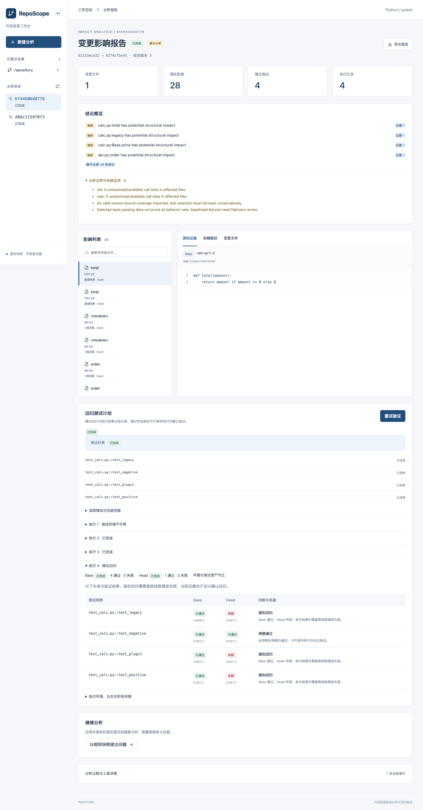

# RepoScope

**代码变更影响分析与回归验证工作台。** 输入本地 Python Git 仓库的两个提交，查看两侧符号变化、潜在调用方、证据路径和测试验证状态。

当前交付为可运行开发版 `0.2.0`，不是升级计划所有阶段均已验收的正式版本。固定快照、CLI/API/工作台、两仓库 Docker 对照、解析增量和本地强检索实测已落地；推理模型真实接入、Agent 公平对照和正式标注评测仍待完成。逐项状态见 [交付清单](docs/delivery-status.md)。



## 启动

需要 Python 3.12、uv、Node.js 22+。本次实际环境为 Python 3.12.13、Node 26；Python 与前端依赖分别由 `uv.lock` / `package-lock.json` 固定。

```bash
uv sync --frozen --extra dev
npm --prefix apps/web ci
npm --prefix apps/web run build
# 终端一：默认只监听本机
uv run --frozen reposcope serve
# 终端二：单个持久化 worker
uv run --frozen reposcope worker
```

打开 http://127.0.0.1:8000。先登记仓库，再填写 base/head（例如 `HEAD~1` / `HEAD`）。只有 commit 对比受支持；分析不会使用未提交改动，不修改目标工作区。PR 模式显式比较 merge-base 到 head，报告显示实际 SHA。

默认允许登记当前工作目录下的仓库；其他目录通过 `REPOSCOPE_ALLOWED_ROOTS` 配置，多个路径使用操作系统路径分隔符。状态默认存储于 `artifacts/state`，可通过 `REPOSCOPE_HOME` 指定。环境变量需在启动前导出；`.env.example` 为配置说明，不自动加载。

## CLI

```bash
uv run reposcope register /absolute/path/to/repository
# 使用上一命令返回的 repo_id
uv run reposcope index REPO_ID --commit HEAD
uv run reposcope analyze REPO_ID BASE_SHA --head HEAD_SHA --output artifacts/report.json
uv run reposcope search SNAPSHOT_ID total
uv run reposcope callers SNAPSHOT_ID SYMBOL_ID
uv run reposcope verify RUN_ID
# 提交测试任务，需要 worker 和已准备的 Docker profile
uv run reposcope test RUN_ID
uv run reposcope status RUN_ID
# 环境修复后的显式重试（最多3个attempt）
uv run reposcope test RUN_ID --attempt 2 --reason "Environment prepared"
```

API 文档在 `/docs`。分析创建支持 `Idempotency-Key`；SSE 支持 `Last-Event-ID`；JSON、Markdown、HTML 来自同一报告 revision。测试只在显式请求后执行。

## 执行环境

目标代码仅由 Docker runner 执行。没有 Docker、镜像或登记 profile 时，显示 `test_environment_unavailable`，不会偷偷在宿主机运行。构建与登记方式见 [执行配置](docs/profiles/README.md)。测试容器使用固定命令、断网、资源上限和独立 Git 快照目录。

本机已安装 Docker + 独立 Colima 环境，自建fixture与Click/HTTPX固定测试池均完成真实容器验证，取消与超时也实际通过。`benchmarks/runners/*probe.py` 是可信公开仓库的 **M0 本地环境探针**，不经过产品 runner，不能视为隔离验收。API/worker 默认在宿主机运行，以便 worker 管理测试容器；应用容器方案见 [部署说明](docs/deployment.md)。

## 实测与重放

[基准说明](benchmarks/README.md) 提供两个固定公开仓库与 12 条开发变异的重放命令。机器结果保存在 `benchmarks/results/`。

| 检查 | 实测范围 |
|---|---|
| pytest 收集 | Click 8.1.8：650；HTTPX 0.28.1：1413 |
| 真实 Docker 同池对照 | Click：base 39 passed，head 35 passed / 4 failed；HTTPX：base 106 passed，head 105 passed / 1 failed；各复跑一次状态一致 |
| 保守测试选择 | 两池选中 39/39、106/106；缩减率 0%，不宣称节省 |
| 本地强检索 | 两仓库 4 个英文查询；2 次磁盘重载排名一致，非质量金标 |
| 全量/解析增量一致性 | 12 条开发变异；以同一 head 的规范化 hash 比较 |
| 标注状态 | unreviewed；不作为正式质量、召回率或泛化结论 |

这些是环境与工程正确性证据。没有将旧 GraphRAG 评测、未执行的模型基线或目标提升数字包装成新项目效果。增量复用未变文件 AST 产物，所有跨文件引用重新解析；称为“解析增量”，不声称端到端向量增量。

## 检索与 Agent

默认结构化 diff 分析不依赖模型。标识符/BM25/RRF 可直接运行；`Search.strong_query` 要求本地存在明确 revision 的 Embedding 与 Reranker，缺失时明确失败。已用固定MiniLM Embedding/CrossEncoder实际完成4个开发查询与资源测量，详情见 [ADR004](docs/decisions/004-local-strong-retrieval.md)；尚未完成正式B1质量比较。

可选 `agent=true` 使用兼容 OpenAI 的结构化决策，通过 `REPOSCOPE_LLM_BASE_URL`、`REPOSCOPE_LLM_MODEL`、`REPOSCOPE_LLM_API_KEY` 配置。默认只补查证据，最多6轮、12次工具、60秒补查预算；只有显式开启 `allow_tests` 才能在预算内选择一次Base/Head验证并读取反馈，不自行执行shell或修改代码。固定流程也支持相同授权与执行器。相同查询去重，出错保留确定性报告；模型API尚未配置，因此未宣称真实B4/B3对照或收益。

## 开发与文档

```bash
uv run --frozen pytest
uv run --frozen ruff check src/reposcope tests/reposcope benchmarks
uv run --frozen ruff format --check src/reposcope tests/reposcope benchmarks
npm --prefix apps/web run build
# Playwright 使用本机 Google Chrome；契约测试不等于后端精度评测
npm --prefix apps/web run test:e2e
```

- [升级计划](docs/reposcope-upgrade-plan.md) / [交付状态](docs/delivery-status.md)
- [技术报告](docs/reposcope-technical-report.md) / [面试指南](docs/reposcope-interview-guide.md)
- [设计决策](docs/decisions/001-implementation-boundaries.md) / [基准范围](docs/decisions/002-benchmark-scope.md)
- [演示脚本](docs/demo.md) / [部署](docs/deployment.md)

源码在 `src/reposcope/`，前端在 `apps/web/`。旧文档抽取、社区摘要、Gradio、金融/论文数据、旧测试及安装残留已退出当前项目；历史保留于原 Git 提交。项目在 NetworkX、Python AST、FastAPI、pytest、coverage.py、React Flow 等开源组件之上实现快照、有限解析、影响证据与执行协调，不把这些基础算法称为原创。
