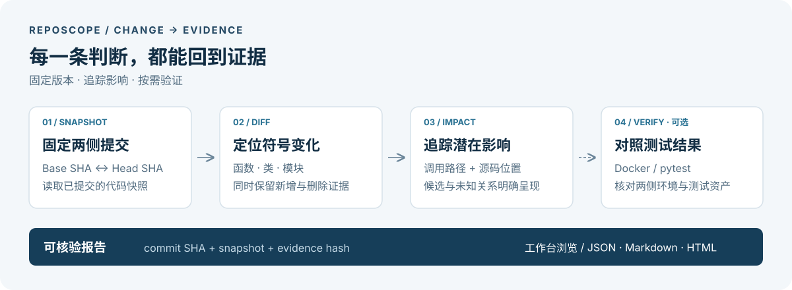

<div align="center">

# RepoScope

**从代码变更出发，追踪影响路径，用测试核对判断。**

面向 Python Git 仓库的代码变更影响分析与回归验证工作台。

[快速上手](#快速上手) · [核心能力](#核心能力) · [验证与边界](#验证与边界) · [文档](#文档)

</div>



一个函数被修改或删除之后，哪些调用方可能受影响？应该检查哪些测试？测试失败是否真的与这次变更有关？

RepoScope 将 **Git diff、代码关系图、源码证据和 Base/Head 测试结果**放进同一份报告。你可以从变化的符号出发，沿路径查看潜在影响，跳转到对应版本的源码，再按需执行测试验证。适合提交审查、回归排查和理解陌生 Python 仓库。

> 当前为可运行开发版 **0.2.0**。核心分析无需模型或 API Key；本地语义检索、Agent 和 Docker 测试按需启用。正式效果评测仍在推进，详见[交付状态](docs/delivery-status.md)。

## 核心能力

| 你想知道什么 | RepoScope 如何回答 |
| --- | --- |
| **这次改了什么？** | 固定 Base/Head 快照，比较函数、类和模块；删除符号仍从 Base 图追踪，避免只看新版本而漏掉旧调用关系。 |
| **可能影响哪里？** | 沿调用、导入和继承关系查找潜在影响，展示路径及源码证据；区分已解析、候选和未知关系。 |
| **该检查哪些测试？** | 结合静态关系与满足绑定条件的覆盖率证据推荐测试；证据不足时保守回退，并说明选择理由。 |
| **两侧行为有何不同？** | 在服务端配置的 Docker 环境中收集并运行 pytest，逐项对照 Base/Head 状态，检查环境与测试资产是否可比。 |
| **结论能否复查？** | 报告关联 commit SHA、snapshot 和 evidence hash；工作台查看源码与路径，同一报告版本可导出 JSON、Markdown 和 HTML。 |

### 为连续变更而设计

- **增量索引**：复用未变文件的解析结果，依据已观察到的导出依赖决定哪些文件需要重新解析引用；全量与增量结果通过语义 hash 对照。
- **可选混合检索**：默认提供标识符、BM25 与 RRF 检索；本地模型模式增加 Dense 检索和 CrossEncoder 重排，复用内容寻址的向量缓存。
- **一致的索引发布**：按 profile 发布不可变索引版本；发布失败或语料不完整时保留上一版本，查询使用已发布的完整版本。
- **有界 Agent**：通过结构化工具补查证据，在轮数、工具和时间预算内工作；显式授权后可触发一次双侧测试并读取反馈。

## 快速上手

需要 **Git、Python 3.12 和 [uv](https://docs.astral.sh/uv/getting-started/installation/)**。使用 Web 工作台还需 **Node.js 22+**。静态分析无需 Docker。

### 1. 安装

```bash
git clone https://github.com/shijezhang/RepoScope.git
cd RepoScope
uv sync --frozen
```

### 2. 先跑一次分析

以 RepoScope 自身为例，比较最近两个提交：

```bash
# 保存登记返回的仓库 ID
REPO_ID=$(uv run --frozen reposcope register "$PWD")
uv run --frozen reposcope analyze "$REPO_ID" HEAD~1 --head HEAD \
  --output artifacts/report.json
```

输出包含两侧实际 SHA、符号变化、潜在影响和证据。CLI 会完成本次分析，无需另启 worker；若最近提交仅修改文档，Python 符号变化为空属于正常结果。

分析自己的仓库时，将登记路径替换为本地 Git 仓库路径，并选择要比较的两个提交。默认只允许当前目录下的仓库；外部目录需先设置：

```bash
export REPOSCOPE_ALLOWED_ROOTS=/absolute/path/to/repositories
```

分析读取已提交的 Git 对象，不包含未提交改动。默认直接比较 Base/Head；使用 `--mode pr` 时比较 merge-base 与 Head。

### 3. 打开工作台

```bash
npm --prefix apps/web ci
npm --prefix apps/web run build
uv run --frozen reposcope serve
```

在**另一个终端**进入 RepoScope 目录，启动任务 worker：

```bash
uv run --frozen reposcope worker
```

打开 **[localhost:8000](http://127.0.0.1:8000)**，登记仓库、填写 Base/Head，然后查看分析报告。API 文档位于 [`/docs`](http://127.0.0.1:8000/docs)。

API 与 worker 需要相同的环境配置。状态默认存放在 `artifacts/state`，可通过 `REPOSCOPE_HOME` 修改；[`.env.example`](.env.example) 是配置示例，不会自动加载。

## 按需启用

<details>
<summary><strong>Docker 回归验证</strong> · 在固定环境中比较两侧测试</summary>

准备包含目标仓库测试依赖的镜像，在服务端登记 Docker profile，再将 profile 绑定到仓库：

```bash
uv run --frozen reposcope register /absolute/path/to/repository --profile-id PROFILE_ID
# 对已有分析提交测试任务；需要运行中的 worker
uv run --frozen reposcope test RUN_ID
uv run --frozen reposcope status RUN_ID
```

profile 使用固定镜像 ID 或 digest。测试容器断网、限制资源，在独立 Git 快照目录中执行；运行时不会安装依赖。缺少 Docker、镜像或 profile 时返回 `test_environment_unavailable`。

完整准备步骤见[测试环境配置](docs/profiles/README.md)。应用 Compose 方案仅用于分析；执行目标测试采用宿主机 worker，见[部署说明](docs/deployment.md)。

</details>

<details>
<summary><strong>本地语义检索</strong> · 混合召回、重排与增量向量复用</summary>

先准备本地 Embedding、Reranker 权重及固定模型清单；模型文件不随仓库分发。获取快照后，显式传入清单即可使用强检索：

```bash
uv run --frozen reposcope index REPO_ID --commit HEAD
# 使用上一命令返回的 snapshot_id
uv run --frozen --extra models reposcope search SNAPSHOT_ID "query" \
  --models /absolute/path/to/models.json
```

需要固定查询版本时，使用 `publish-index` 与 `search-published`：

```bash
uv run --frozen reposcope publish-index REPO_ID --commit HEAD --profile default
uv run --frozen reposcope search-published REPO_ID "query" --profile default
```

这两条命令默认发布、查询基础检索索引；强检索模式需同时添加 `--extra models` 和 `--models` 清单。模型缺失或输入超限时明确失败，语料不完整时保留 `partial` 状态。

详见[本地检索设计](docs/decisions/004-local-strong-retrieval.md)、[模型文件校验](docs/decisions/009-local-model-file-binding.md)及[索引发布](docs/decisions/011-published-index-profiles.md)。

</details>

<details>
<summary><strong>Agent 补查</strong> · 接入兼容 OpenAI 的推理服务</summary>

在本地配置文件中提供 `base_url`、`model`、`api_key`，或用 `api_key_env` 引用密钥环境变量。在启动 API 和 worker 前设置：

```bash
export REPOSCOPE_LLM_CONFIG=/absolute/path/to/provider.local.json
```

也支持 `REPOSCOPE_LLM_BASE_URL`、`REPOSCOPE_LLM_MODEL`、`REPOSCOPE_LLM_API_KEY`，环境变量优先于配置文件。启用 Agent 后，相关源码证据会发送到所配置的推理服务。

Agent 默认只补查证据，不执行任意 shell 或修改代码；只有显式开启 `allow_tests` 才能请求测试。当前 Agent 工具使用基础检索，尚未默认接入上述本地强检索。错误或预算耗尽时保留已有分析结果。

</details>

## 验证与边界

截至 **2026-09-10** 的工程验证：

| 检查 | 已验证范围 |
| --- | --- |
| 自动化检查 | 140 项后端测试、5 项前端契约测试；构建与 lint 通过。前端契约测试使用 mock，不代表效果评测。 |
| 增量一致性 | parser v5 在 12 条开发变更与 2 条历史修复上，全量/增量语义 hash 一致。 |
| 真实执行 | Click、HTTPX 固定测试池完成 Docker Base/Head 对照；取消、超时与覆盖率链路有实测记录。 |
| Agent 闭环 | 两个开发 fixture 在原预算内完成测试与反馈；未证明优于固定流程。 |

原始记录见[验证清单](docs/validation.json)、[最新工程验收](docs/progress-v5-2026-09-10.md)与[基准重放说明](benchmarks/README.md)。这些结果验证当前实现的工程行为；正式质量标注、完整消融与泛化评测尚未完成，现有测试池也未获得测试数量缩减收益。

使用时需要理解三个边界：

- **潜在影响不等于确定故障。** 当前解析器面向 Python，采用有限静态解析；反射、动态导入和运行时绑定可能保留为候选或未知。
- **任务完成不等于证据完整。** 报告可以是 `partial`；未执行的测试不会标成通过。
- **一次失败不等于已确认回归。** Base 通过、Head 失败会标记为疑似回归；仍需复跑排除偶发失败，并核对环境和测试资产。

## 文档

| 入口 | 内容 |
| --- | --- |
| [演示流程](docs/demo.md) | 从登记仓库到查看报告的操作步骤 |
| [部署与配置](docs/deployment.md) | API、worker、存储与容器运行方式 |
| [实现契约](docs/decisions/001-implementation-boundaries.md) | 快照、证据、解析与执行边界 |
| [依赖失效设计](docs/decisions/013-resolution-dependency-cache.md) / [向量复用设计](docs/decisions/012-content-vector-reuse.md) | 连续变更时如何减少重复工作 |
| [交付状态](docs/delivery-status.md) / [升级计划](docs/reposcope-upgrade-plan.md) | 当前进度与后续验收目标 |

## 开发

后端位于 `src/reposcope/`，使用 Python AST、NetworkX、FastAPI 与 SQLite；前端位于 `apps/web/`，使用 React、TypeScript 与 React Flow。

```bash
uv sync --frozen --extra dev
uv run --frozen pytest
uv run --frozen ruff check src/reposcope tests/reposcope benchmarks
uv run --frozen ruff format --check src/reposcope tests/reposcope benchmarks
npm --prefix apps/web ci
npm --prefix apps/web run build
# 前端契约测试使用本机 Google Chrome
npm --prefix apps/web run test:e2e
```

欢迎通过 Issue 或 Pull Request 提交可复现问题、解析反例和改进。修改解析规则时，请升级 parser version 并验证全量/增量一致性。

## License

[MIT](LICENSE)
