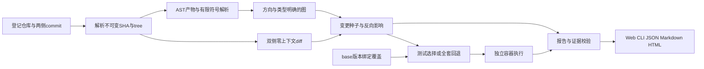
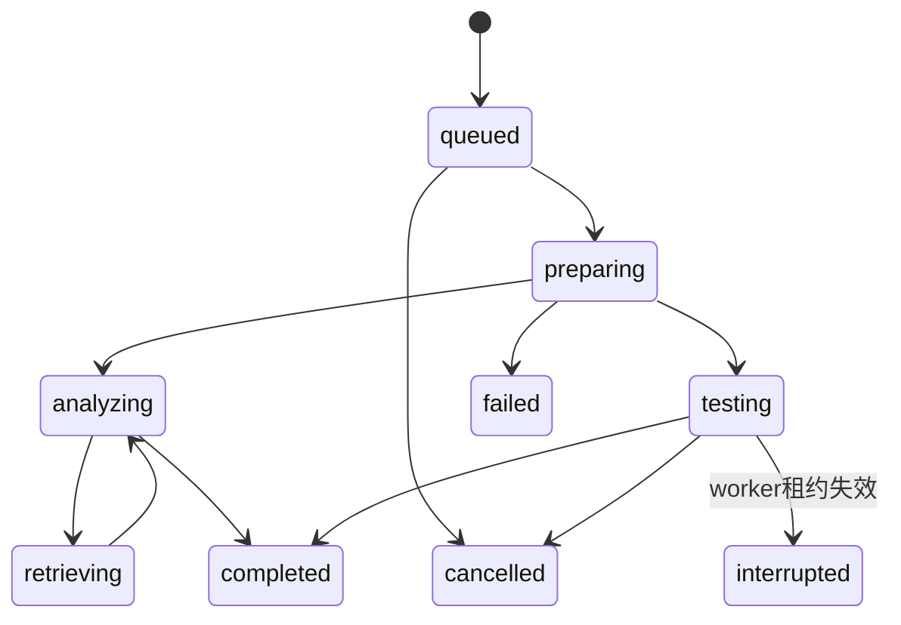

# RepoScope 技术报告

版本：0.2.0 开发交付，2026-09-10。代码与证据范围以 [交付状态](delivery-status.md) 为准。

## 1. 要解决的问题

给出一个陌生 Python 仓库和两个 commit，开发者需要知道改动属于哪些符号、哪些调用方值得检查、应该运行哪些测试，以及已有结论究竟依据源码关系还是运行结果。单纯“问整个仓库”难以保留版本与验证边界。

RepoScope 把核心输出定义为结构化变更报告。自然语言和局部图用于解释，不能替代源码与执行证据。主流程无需模型即可重放；这保证模型不可用时仍能输出变更、影响和未验证项。

## 2. 从输入到报告

登记仓库路径必须位于服务端允许根目录。API 接受 base/head 后立即解析成 commit SHA，队列中保存 SHA 而非会移动的分支名。PR 模式先求 merge-base，并显示实际比较范围。Git 文件清单和 diff 使用 NUL 分隔，路径包含空格不会依赖字符串空格切分。

解析直接从 Git blob 读取，不 import 目标模块。只分析受支持文本类型；测试 checkout 则从完整 Git tree 复制普通文件，包含资产与配置。执行拒绝 symlink/submodule，避免解析快照与测试目录不一致。

## 3. 数据契约与源码导航

| 入口 | 输入 → 输出 | 设计职责 |
|---|---|---|
| `repository/git.py` | 路径、revision → SHA、文件内容、双侧diff | 固定比较语义与资源限制 |
| `indexing/parser.py` | 文件内容 → Symbol、Relation、unresolved | AST定义与有限跨文件解析 |
| `graph/store.py` | 不可变对象、任务 → SQLite事务 | 快照、证据、事件、revision、租约 |
| `analysis/impact.py` | 两侧图和diff → 潜在影响路径 | 删除/改名、模块回退、图预算 |
| `retrieval/search.py` | 固定快照与query → 排序符号 | 标识符/BM25/RRF，显式强模型入口 |
| `analysis/selection.py` | 可收集nodeid、覆盖、预算 → 测试选择 | 权重覆盖贪心或全套回退 |
| `execution/runner.py` | 快照、profile、nodeid → 运行证据 | Docker约束、幂等、取消、回收 |
| `coverage/__init__.py` | context与binding → 版本绑定覆盖 | 拒绝错版本与非法行信息 |
| `agent/controller.py` | 证据缺口 → 有界补查轨迹 | 工具参数、作用域、去重与预算 |
| `reports/render.py` | 结构化报告 → 引用校验与导出 | 验证符号、路径、源码位置与hash |
| `api/app.py` / `jobs/worker.py` | REST任务 → 异步处理和事件 | API不直接承担长测试 |

Symbol ID 使用快照、路径、限定名、种类和同名定义序号；行号只负责定位。跨版本映射使用明确的路径/限定名/种类，并保留内容是否一致。Git重命名是启发式，未识别时按删除加新增分析。

Snapshot JSON 一次写入SQLite；内存MultiDiGraph是可重建视图。当前没有独立向量索引的原子发布，不能把它描述为全部索引已事务性增量更新。

## 4. 有限 Python 解析

模块、函数、异步函数、类、方法、测试函数有独立符号。包含、导入、调用、继承分别保存方向和来源位置。导入别名、普通/相对导入、显式重导出与直接调用可提供确定结构证据。

“resolved”表示满足当前静态规则，仍不证明运行时必然发生。`self.method` 在缺少唯一类型证明时保留candidate。反射、未知属性、工厂返回、运行时注册、复杂装饰器和匿名作用域中的动态调用保留unknown。参数、赋值或导入覆盖不能被当成原函数；方法的裸名称查找也不能错误落到类命名空间。

解析失败文件出现在diagnostics，快照为partial。图传播遇到节点/深度上限显式truncated。报告最终可能是completed任务但partial分析，这是两个不同维度。

## 5. 双侧影响与证据路径

旧行区间映射到base，新行区间映射到head。删除旧函数后仍能从base追踪未改调用方；新增函数从head分析。函数签名/函数体与模块初始化分别成为种子。类声明和内部方法同时改变时不能只选择最深方法而丢掉类头。

影响传播主要沿CALLS/IMPORTS/INHERITS入边查潜在依赖方。模块/类种子可以保守扩展成员，但CONTAINS不能作为任意调用边混用。每条路径保留真实关系字段与遍历方向，validator验证从影响符号至变更种子的连续性，不能仅检查每条边“在图里存在”。

证据引用绑定snapshot、path、start/end与内容hash。base/head报告可以并存两侧证据，但不能混入第三快照。ID正确也不保证自然语言结论语义正确，人工支持率需要另做标注复核。

## 6. 测试选择与结果解释

pytest在固定环境真实收集nodeid，参数化信息来自collection，分析器不自行拼不存在的测试名称。无有效base覆盖时首次全套回退。已有覆盖需匹配base快照、环境、套件hash与采集配置，并只作为head推荐线索。

选择器以重要影响符号为目标，用覆盖收益/历史耗时排序；缺口、动态解析不足、配置或fixture变化触发全套回退。当前保守规则可能使真实仓库经常回退全套；未报告任何已证明的测试缩减收益。

pytest插件分setup/call/teardown采集，模块导入等无归属行单独保存。共享fixture的setup仅在部分消费者执行，不能据此推断全部消费者的断言覆盖。

执行结果保留passed、failed、error、skipped、xfail、xpass、timeout、cancelled、not_run。容器正常产出是execution completed，不意味着测试全部通过。相同nodeid的对照还需要测试/配置资产和环境一致；base通过而head断言失败标suspected_regression，尚未排除flaky时不写confirmed。base也失败是existing_failure；新增测试失败单独显示。

## 7. Agent 的实际边界

固定主流程负责快照、diff、影响、选择和引用校验。可选模型决定find_symbol、search_code、get_neighbors、find_paths、read_evidence、get_test_candidates、get_test_result或finish；显式allow_tests授权后还可选择一次run_tests。工具参数使用Pydantic校验，限制快照归属和结果量；模型不能任意传shell命令。输出保存简短决策原因与工具事实，不保存内部思维链。

相同查询基于run/tool/arguments hash去重，最多6轮/12工具/60秒补查预算（测试受任务总预算约束）；累计token设上限。模型不可用、超时、重复查询等都保留确定性报告和限制。测试授权开启时，工具可执行登记计划并将真实对照摘要交回模型，固定流程共享执行器；该反馈契约已测试。当前尚无配置的真实推理模型或B4/B3公平对照，不能把闭环代码存在称为已证明的Agent收益。

## 8. 增量、持久化与恢复

文件解析缓存按路径+源码+解析器版本复用。每次新快照全部跨文件关系重新解析，避免删除/导出修改留下旧入边。当前不实现最小反向依赖失效集合，代价是跨文件解析时间不会减少。这一取舍写入ADR，规范化全量/增量hash用于验证，不用“缓存命中率”替代一致性。

API创建任务后立即返回。worker持有租约与心跳，完成步骤写入SQLite。测试execution身份先保存再提交，重复ID不重提；profile变化产生冲突。失联测试进入interrupted，按已有身份检查/回收容器，保留清理是否确认，不能不加核对地重启测试。分析计算本身可重做，但已持久化报告与工具记录不会变成重复外部测试提交。

SSE使用递增event_id，断线可从游标继续。前端还轮询任务状态；刷新不会新建任务。每次测试结果追加report revision，旧revision可以单独导出。

## 9. 实验与真实案例

可重放来源、commit、变异和环境在 `benchmarks/manifests` / `benchmarks/cases`。12条全部为开发探针、unreviewed；不能作为120条正式任务集，也不能计算可信Precision/Recall。所有公开摘要由runner产生。

| 实验 | 条件 | 观察 | 不能推出的结论 |
|---|---|---|---|
| 两仓库collection | Python3.12.13独立本地环境 | Click650 / HTTPX1413 | 容器环境已验收 |
| Click区间边界变异 | Linux Docker固定types测试池 | base39通过；head35通过4失败；复跑一致 | 生产缺陷/完整仓库测试选择效果 |
| HTTPX状态码边界变异 | Linux Docker固定responses测试池 | base106通过；head105通过1失败；复跑一致 | 图召回率或Agent收益 |
| 保守选择 | 相同登记测试池，仅base覆盖与源码 | 39/39和106/106，缩减0% | 测试时间节省 |
| 强检索可运行性 | 固定双模型，两仓库4英文查询 | 4次成功，2次缓存复读相同 | 正式检索质量或中文适用性 |
| 解析一致性 | 12条同head全量/增量 | 规范化hash一致 | 向量索引增量/稳定2倍加速 |

Click案例改变范围下界开闭的比较运算符，真实已有测试能发现边界行为变化。HTTPX案例把客户端错误范围判断排除4xx，响应测试可复现失败。这些都是明确标注的人工变异，不冒充历史线上事故。试验pool很小，分析可能比直接运行全部pool更慢；本轮价值主要验证可解释影响和版本证据，而非宣称节约测试时间。

源码审查另外添加作用域、覆盖导出、类头与路径反例，先复现错误再修复。失败样例保留在测试中。动态调用fixture则继续输出unknown，不通过编造边提升表面覆盖率。

## 10. 剩余工作与贡献边界

目标Docker已在fixture和两真实仓库固定池实测，模型revision与资源测量亦已完成。应用Compose、强检索正式质量基线、图/覆盖消融、真实Agent同预算比较、正式标注及holdout仍需完成。未取得这些证据前，不写10个百分点提升、95%回归检出或2倍增量速度。

独立实现部分是版本契约、有限符号解析、双侧变更映射、证据连续性校验、任务/执行幂等和产品工作台；Python AST、NetworkX、BM25/RRF、pytest/coverage、React Flow来自标准库或开源算法。旧GraphRAG仅提供检索与工程经验，旧业务结果没有迁入本项目效果。

## 11. 最新资源与运行观察

Click容器首轮测试总wall约5.65/5.13秒（base/head），pytest阶段仅0.122/0.125秒；HTTPX总wall约9.80/11.54秒，pytest阶段0.647/0.961秒。准备与容器开销不能隐藏。首轮镜像构建耗时没有采集，未追溯伪填。

强检索向量构建约8.06/8.38秒，同快照后续不同查询约0.37/0.79秒，进程RSS高水位约837MB。HTTPX首位有不理想的测试/模块节点，保留原结果，没有针对这4个未标注查询调到看起来更好。

重放目录改为不可变run目录，旧报告引用的Git对象不随新实验删除。历史fixture对象曾在旧重放逻辑中丢失，已从持久化源码按原作者/时间重建，commit及tree精确一致后恢复refs；修复及验证记录保留，原报告未改写。
